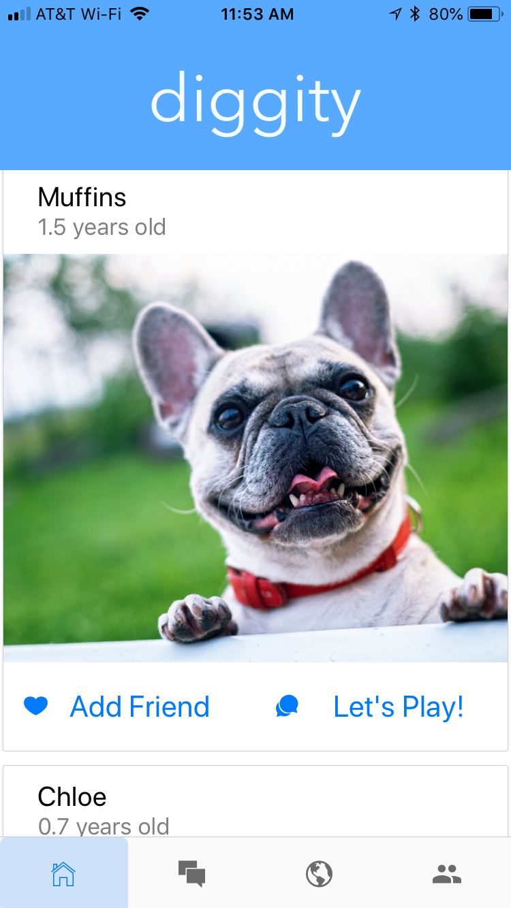

# **diggity**

Diggity is a social networking app for dog lovers. It allows dog owners to create profiles for their pets
which they use to connect with other users nearby.

**[Link](https://youtu.be/xXlfUxhcSGA) to the demo video!**

## **Getting Started**

To run - fork and clone this repo to your local machine. Make sure you either have Expo on your
phone, or xcode / android studio on your computer. From the terminal, navigate to the directory, "Diggity" and run `npm i` to install all dependencies. Then run `npm start`.

## **Author**

- Matthew Hyrka
- mhyrka@gmail.com
- linkedin.com/in/mhyrka

### **License**

MIT

